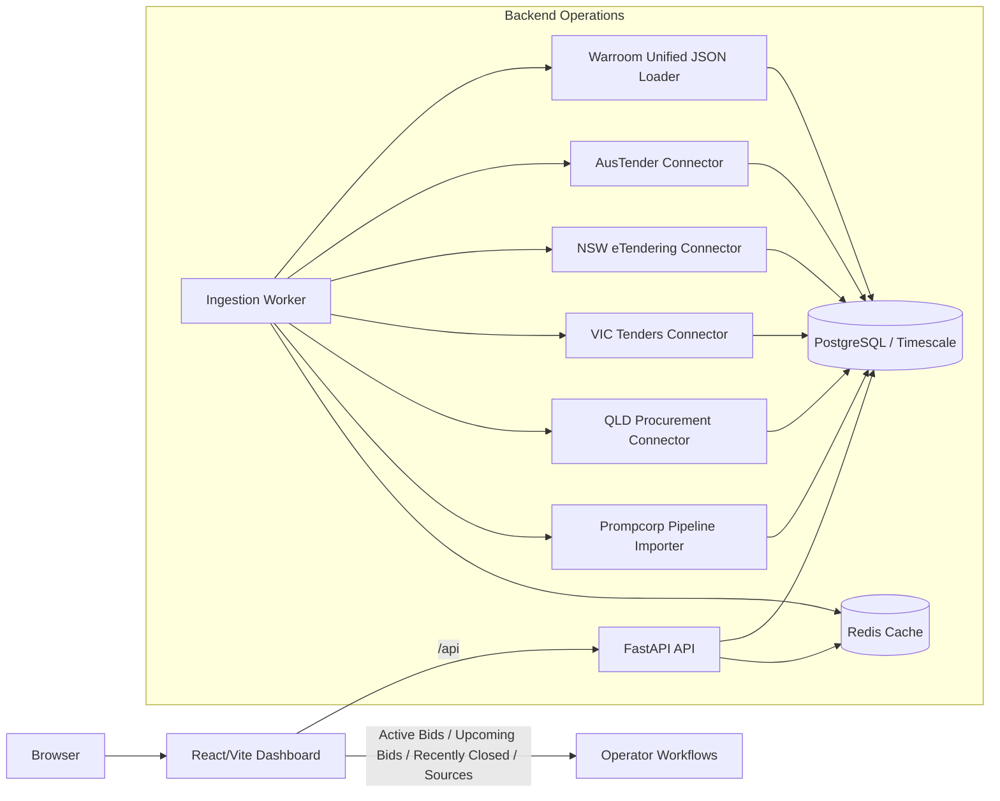

# Prompcorp Tender Intelligence

`combine/` is a new platform that blends the best reuse paths from the two source repos:

- `Sovereign_Watch`: ingestion orchestration, backend service layout, persistence, and operational source monitoring
- `worldmonitor`: dashboard shell thinking, modular panels, filters, summary views, and user-facing presentation

The result is not a clone of either upstream project. It is a new tender intelligence platform for Australian procurement tracking and bid-pipeline operations.

## What Is Included

- Multi-source connector ingestion for `austender`, `nsw_etendering`, `vic_tenders`, `qld_procurement`, and `prompcorp_pipeline`
- Unified JSON snapshot ingestion for `warroom_dashboard_data.json`
- Shared normalized tender schema across all connectors
- FastAPI backend with tender list, dashboard summary, source health, and ad-hoc ingestion trigger endpoints
- PostgreSQL/Timescale-friendly persistence
- Redis-backed summary caching
- React/Vite dashboard aligned to the brief's core operator views: `Active Bids`, `Upcoming Bids`, `Recently Closed`, and `Sources`

## Reuse Strategy

### Sovereign_Watch-inspired backend choices

- Python service layout under `backend/api`
- Connector-oriented ingestion under `backend/ingestion`
- Persistent database plus operational source-run logging
- Separate long-running ingestion worker

### worldmonitor-inspired frontend choices

- Unified dashboard shell with mode switching
- KPI cards, charts, filters, and tabbed operator views
- API-driven presentation rather than source-specific UI logic
- Single operator-facing application instead of fragmented admin screens

## Directory Layout

```text
combine/
|-- backend/
|   |-- api/
|   |-- common/
|   |-- db/
|   `-- ingestion/
|-- frontend/
|-- k8s/
`-- docker-compose.yml
```

## API Surface

- `GET /health`
- `GET /api/dashboard/summary`
- `GET /api/sources/health`
- `GET /api/tenders`
- `GET /api/tenders/{tender_id}`
- `POST /api/tenders/admin/run-ingestion`

## Architecture



## Data Model Highlights

Every source is converted into one shared tender record with:

- source metadata
- external ID
- buyer or agency
- title and summary
- stage
- close date
- disclosed value
- state, region, and category
- internal metadata for Prompcorp pipeline items

This keeps public tender opportunities and internal bid pursuits visible in one coherent operating picture.

## Recommended Unified Source

The preferred workflow is to place one normalized seed file at the repo root:

- `warroom_dashboard_data.json`

Then set:

- `WARROOM_JSON_SOURCE_URL=/project-root/warroom_dashboard_data.json`

When this variable is set, the dashboard uses unified JSON mode and treats the older split-source variables as legacy fallback inputs.

## Preferred Deployment Path

Kubernetes on a self-hosted MicroK8s-style environment is now the recommended deployment target.

- Kubernetes manifests live under `combine/k8s/`
- The deployment runbook is in [DEPLOYMENT_K8S.md](./DEPLOYMENT_K8S.md)
- Docker Compose remains available for local development and simple evaluation

## Sample Data

If you leave the source URLs blank and keep `ENABLE_SAMPLE_DATA=true`, the system uses bundled sample datasets in `backend/ingestion/samples/`. That makes local bring-up easy before live connectors are tuned against real source formats.

## Using Local Export Files

You can also point connectors at local export files instead of remote URLs.

- `AUSTENDER_SOURCE_URL` may point to a local `.json`, `.jsonl`, or `.csv` file
- `VIC_TENDERS_SOURCE_URL` may point to a local JSON file or to a `vic_tenders_ckan.py` output directory such as `vic_data/`

This makes it possible to run external harvesters first, then let `combine/` ingest and monitor the resulting files in the dashboard.

## Deployment

- Preferred: [DEPLOYMENT_K8S.md](./DEPLOYMENT_K8S.md)
- Docker Compose fallback: [DEPLOYMENT.md](./DEPLOYMENT.md)
